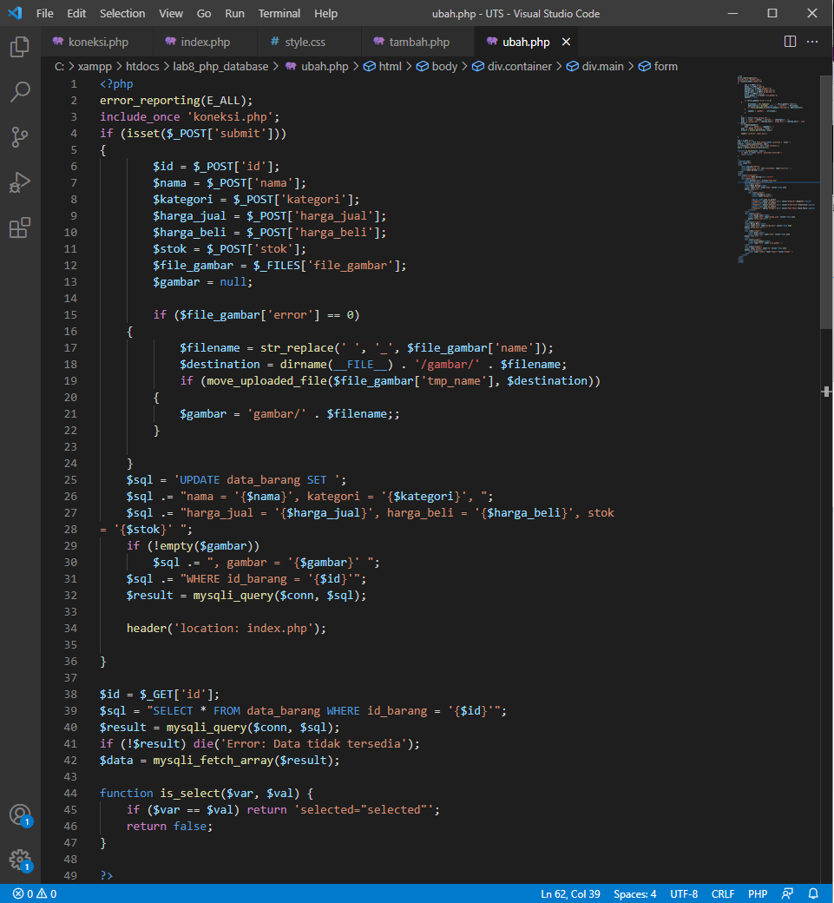

# Lab8Web

### Nama        : Panji Putra Pamungkas
### Nim         : 311910587
### Kelas       : TI. 19. B1
### Mata Kuliah : Pemograman Web - Praktikum 8

### CRUD sederhana dengan database MySQL

#### 1. Membuat database.

Buka XAMPP

Buat database latihan1 dan tabel data_barang.

Isi tabel tersebut dengan data.

Dan dibawah ini adalah tampilan datanya.

#### 2. Membuat Program CRUD

Membuat folder lab8_php_database pada root directory web server (d:\xampp\htdocs)

Kemudian untuk mengakses direktory tersebut pada web server dengan mengakses URL:
http://localhost/lab8_php_database/

#### 3. Membuat koneksi

Dibawah ini adalah koding nya.

Dan berikut tampilannya ketika sudah uncomment pada perintah echo “koneksi berhasil”;

#### 4. Membuat Index.php

Dibawah ini adalah koding nya.

Dan berikut tampilannya pada browser

#### 5. Membuat Tambah.php

Dibawah ini adalah koding nya.

Dan berikut tampilannya pada browser

Dan berikut adalah bukti bahwa tambah.php berfungsi

#### 6. Membuat Ubah.php

Dibawah ini adalah koding nya.

Dan berikut adalah bukti bahwa tambah.php berfungsi

#### 7. Membuat Hapus.php

Dibawah ini adalah koding nya.

